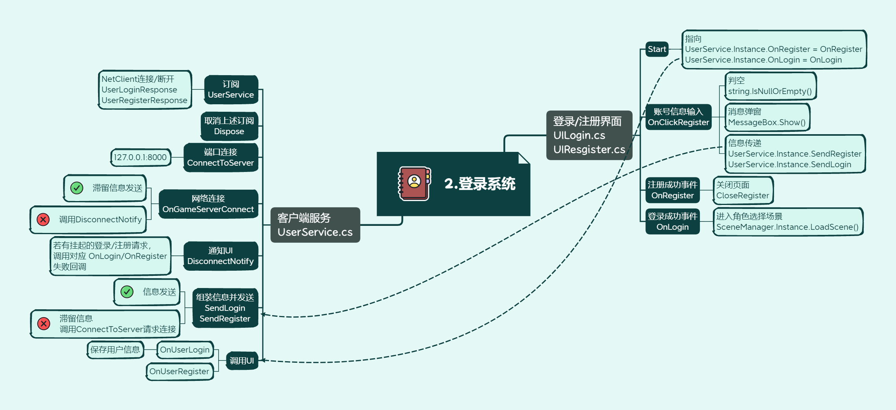

# 01MMORPG学习

# 笔记02_登陆系统



## 目录

1. [单例模式（Singleton）](#1-单例模式singleton)
2. [UnityAction 回调委托](#2-unityaction-回调委托)
3. [回调注册与覆盖问题](#3-回调注册与覆盖问题)
4. [UI 面板互切（SetActive）](#4-ui-面板互切setactive)
5. [输入校验（string.IsNullOrEmpty）](#5-输入校验stringisnullorempty)
6. [消息弹窗（MessageBox）](#6-消息弹窗messagebox)
7. [待发消息队列（pendingMessage 模式）](#7-待发消息队列pendingmessage-模式)
8. [消息订阅与分发（MessageDistributer）](#8-消息订阅与分发messagedistributer)
9. [网络连接与断开处理](#9-网络连接与断开处理)
10. [场景切换（SceneManager）](#10-场景切换scenemanager)
11. [整体调用流程图](#11-整体调用流程图)

---

## 1. 单例模式（Singleton）

### 是什么

**单例**保证一个类在整个游戏生命周期中**只有一个实例**，并提供一个全局访问点 `Instance`。`UserService` 继承了 `Singleton<UserService>`，所以任何地方写 `UserService.Instance` 拿到的都是同一个对象。

### 最简代码示例

```csharp
// 一个极简的泛型单例基类
public class Singleton<T> where T : new()
{
    private static T _instance;

    public static T Instance
    {
        get
        {
            if (_instance == null)
                _instance = new T();
            return _instance;
        }
    }
}

// 使用
public class UserService : Singleton<UserService>
{
    public void SayHi() => Debug.Log("Hello from UserService");
}

// 任何地方调用
UserService.Instance.SayHi();
```

### 常见使用场景

| 场景     | 示例                                       |
| -------- | ------------------------------------------ |
| 网络管理 | `NetClient.Instance.Connect()`             |
| 音频管理 | `AudioManager.Instance.PlayBGM()`          |
| 全局数据 | `GameDataManager.Instance.GetPlayerData()` |
| UI 管理  | `UIManager.Instance.ShowPanel("Login")`    |

> **注意**：单例方便但不要滥用，它本质是全局变量，过多会让依赖关系混乱。

---

## 2. UnityAction 回调委托

### 是什么

`UnityAction<T1, T2>` 是 Unity 封装的委托类型（本质就是 C# 的 `Action<T1, T2>`）。它的作用是：**"我先告诉你将来要执行什么函数，等条件满足时你来调我"**。

在本项目中，`UserService` 定义了两个回调：

```csharp
public UnityAction<Result, string> OnLogin;
public UnityAction<Result, string> OnRegister;
```

意思是：当登录/注册结果回来时，调用这个委托，把 `Result`（成功/失败）和 `string`（错误信息）传给 UI。

### 最简代码示例

```csharp
using UnityEngine.Events;

public class NotificationCenter
{
    // 定义一个回调：参数是 bool（是否成功）和 string（消息）
    public UnityAction<bool, string> OnTaskComplete;

    public void FinishTask()
    {
        // 任务完成时，调用回调通知外部
        OnTaskComplete?.Invoke(true, "任务完成！");
    }
}

public class UIPanel : MonoBehaviour
{
    void Start()
    {
        var center = new NotificationCenter();
        // 把自己的方法"挂"上去
        center.OnTaskComplete = HandleResult;
    }

    void HandleResult(bool success, string msg)
    {
        Debug.Log(success ? msg : "失败：" + msg);
    }
}
```

### 常见使用场景

- 网络请求完成后通知 UI 刷新
- 动画播放结束后触发下一步逻辑
- 按钮点击后执行回调
- 计时器到时间后执行函数

---

## 3. 回调注册与覆盖问题

### 是什么

本项目中 `UILogin.Start` 和 `UIRegister.Start` 分别这样写：

```csharp
// UILogin.cs
void Start() {
    UserService.Instance.OnLogin = OnLogin;    // 直接赋值
}

// UIRegister.cs
void Start() {
    UserService.Instance.OnRegister = OnRegister; // 直接赋值
}
```

这里用的是 **`=`（赋值）** 而不是 **`+=`（追加）**。意味着：如果两个界面同时存在，**后执行 Start 的那个会覆盖前一个的回调**。

### 对比：赋值 vs 追加

```csharp
// ❌ 赋值 — 会覆盖
UserService.Instance.OnLogin = MyCallback;   // 之前注册的全没了

// ✅ 追加 — 多个订阅者共存
UserService.Instance.OnLogin += MyCallback;  // 在已有基础上追加

// ✅ 取消订阅
UserService.Instance.OnLogin -= MyCallback;  // 只移除自己
```

### 本项目为什么没出问题

因为设计上同一时刻**只显示一个面板**：登录界面和注册界面互相切换，不会同时 `Start`，所以不会覆盖。

### 常见使用场景

| 方式              | 适用场景                                                     |
| ----------------- | ------------------------------------------------------------ |
| `=` 赋值          | 确定只有一个订阅者，简单直接                                 |
| `+=` 追加         | 多个模块需要监听同一事件（如成就系统 + UI 同时监听"击杀"事件） |
| C# `event` 关键字 | 需要限制外部只能 `+=` / `-=`，不能直接 `=` 或 `Invoke`       |

---

## 4. UI 面板互切（SetActive）

### 是什么

`GameObject.SetActive(bool)` 控制一个游戏物体的**激活/隐藏**。隐藏时物体上所有组件停止工作（`Update` 不跑、渲染不显示）。

本项目用它来实现"登录 ↔ 注册"面板切换。

### 最简代码示例

```csharp
public class UIRegister : MonoBehaviour
{
    public GameObject uiLogin;  // 在 Inspector 拖入登录面板

    public void CloseRegister()
    {
        // 隐藏自己（注册面板）
        this.gameObject.SetActive(false);
        // 显示登录面板
        uiLogin.SetActive(true);
    }
}
```

### 切换方式对比

| 方式                     | 优点         | 缺点                                              |
| ------------------------ | ------------ | ------------------------------------------------- |
| `SetActive`              | 简单、零开销 | 隐藏后 `Start` 不会再次调用（只有首次激活调一次） |
| 切换 `CanvasGroup.alpha` | 可做渐变动画 | 物体仍然存在，可能接收到点击                      |
| 销毁/实例化              | 完全释放内存 | 开销大，需重新初始化                              |
| 场景切换                 | 彻底隔离     | 加载慢，不适合轻量面板切换                        |

### 常见使用场景

- 登录/注册面板互切
- 背包界面打开/关闭
- 暂停菜单显示/隐藏
- 教程提示弹出/消失

---

## 5. 输入校验（string.IsNullOrEmpty）

### 是什么

`string.IsNullOrEmpty(str)` 返回 `true` 当字符串是 `null` 或 `""`（空串）。在用户输入场景下，**必须在发送请求前校验**，避免发送无意义的空数据。

### 最简代码示例

```csharp
public void OnClickLogin()
{
    if (string.IsNullOrEmpty(username.text))
    {
        MessageBox.Show("请输入账号");
        return;
    }
    if (string.IsNullOrEmpty(password.text))
    {
        MessageBox.Show("请输入密码");
        return;
    }
    // 校验通过，发送请求
    UserService.Instance.SendLogin(username.text, password.text);
}
```

### 相关 API 对比

```csharp
string.IsNullOrEmpty(s)      // null 或 "" → true
string.IsNullOrWhiteSpace(s) // null 或 "" 或 "   " → true（推荐）
s?.Trim().Length == 0         // 手动写法
```

### 常见使用场景

- 登录/注册表单校验
- 聊天消息发送前检查
- 搜索框输入校验
- 配置文件字段读取后判空

---

## 6. 消息弹窗（MessageBox）

### 是什么

一个通用弹窗工具类，用于向玩家展示提示信息。支持**纯提示**和**带回调按钮**（点击"确定"后执行某个函数）。

### 最简代码示例

```csharp
// 简单提示
MessageBox.Show("密码不能为空");

// 带确定按钮回调（注册成功后关闭注册界面）
MessageBox.Show("注册成功，请登录", "提示", MessageBoxType.Information,
    "确定", "取消",
    () => { CloseRegister(); }  // 点确定时执行
);
```

### 常见使用场景

- 错误提示（"网络连接失败"）
- 操作确认（"确定要删除角色吗？"）
- 成功反馈（"注册成功，请登录"）
- 系统公告弹窗

---

## 7. 待发消息队列（pendingMessage 模式）

### 是什么

当用户点击登录/注册时，TCP 连接**可能还没建立**。此时不能直接发包，而是：

1. 把要发的消息存到 `pendingMessage`
2. 发起连接 `ConnectToServer()`
3. 连接成功后（`OnGameServerConnect`），检查 `pendingMessage`，有就发出去并清空

这是一种**"先存后发"**的异步处理模式。

### 最简代码示例

```csharp
public class UserService
{
    private NetMessage pendingMessage; // 待发消息
    private bool connected = false;

    public void SendLogin(string user, string pass)
    {
        NetMessage msg = new NetMessage();
        msg.Request = new UserLoginRequest { Username = user, Password = pass };

        if (connected)
        {
            // 已连接，直接发
            NetClient.Instance.SendMessage(msg);
        }
        else
        {
            // 未连接，先存起来，再去连
            pendingMessage = msg;
            ConnectToServer();
        }
    }

    void OnGameServerConnect(int result)
    {
        if (result == 0) // 连接成功
        {
            connected = true;
            if (pendingMessage != null)
            {
                NetClient.Instance.SendMessage(pendingMessage);
                pendingMessage = null; // 发完清空
            }
        }
        else
        {
            // 连接失败，通知 UI
            DisconnectNotify();
        }
    }
}
```

### 为什么不先连接再让用户操作

> 如果一进游戏就连接，玩家可能停留在登录界面很久，白白占用服务器连接。**用户点击时再连**更节省资源。

### 常见使用场景

- 游戏登录（点击时才建立 TCP）
- 聊天系统（发消息时检查 WebSocket 是否连通）
- 断线重连后补发上次未发出的请求

---

## 8. 消息订阅与分发（MessageDistributer）

### 是什么

`MessageDistributer` 是一个**消息路由器**。网络层收到服务器的数据包后，根据包类型自动分发到对应的处理函数。

工作流程：

```
服务器发来 UserLoginResponse 
    → NetClient 收到原始字节 
    → 反序列化成对象 
    → MessageDistributer 根据类型查表 
    → 调用 UserService.OnUserLogin(response)
```

### 最简代码示例

```csharp
// 订阅：告诉分发器，收到 UserLoginResponse 类型时调用 OnUserLogin
MessageDistributer.Instance.Subscribe<UserLoginResponse>(OnUserLogin);

// 处理函数
void OnUserLogin(object sender, UserLoginResponse response)
{
    if (response.Result == Result.Success)
    {
        Debug.Log("登录成功，用户：" + response.Username);
    }
    else
    {
        Debug.Log("登录失败：" + response.Errormsg);
    }
}

// 取消订阅（在 Dispose 中）
MessageDistributer.Instance.Unsubscribe<UserLoginResponse>(OnUserLogin);
```

### 常见使用场景

| 场景 | 订阅消息类型            |
| ---- | ----------------------- |
| 登录 | `UserLoginResponse`     |
| 注册 | `UserRegisterResponse`  |
| 聊天 | `ChatMessageResponse`   |
| 战斗 | `BattleResultResponse`  |
| 背包 | `InventoryUpdateNotify` |

### 设计优势

- **解耦**：网络层不需要知道 UI 怎么处理
- **扩展**：新增消息类型只需 `Subscribe` 一行
- **集中管理**：所有消息路由一目了然

---

## 9. 网络连接与断开处理

### 是什么

`UserService` 监听网络连接和断开事件，在不同状态下做不同处理：

- **连接成功**：发送排队中的消息
- **连接失败**：通知 UI 显示错误
- **断开连接**：检查是否有未完成的请求，通知 UI

### 最简代码示例

```csharp
public class UserService
{
    public UserService()
    {
        // 订阅网络事件
        NetClient.Instance.OnConnect += OnGameServerConnect;
        NetClient.Instance.OnDisconnect += OnGameServerDisconnect;
    }

    void OnGameServerConnect(int result)
    {
        if (result == 0)
        {
            connected = true;
            // 发送排队消息...
        }
        else
        {
            DisconnectNotify(); // 连接失败
        }
    }

    void OnGameServerDisconnect(int result)
    {
        DisconnectNotify();
    }

    void DisconnectNotify()
    {
        connected = false;
        if (pendingMessage != null)
        {
            // 有挂起的登录请求 → 通知 UI "网络错误"
            if (pendingMessage.Request is UserLoginRequest)
                OnLogin?.Invoke(Result.Failed, "服务器连接失败");
            else if (pendingMessage.Request is UserRegisterRequest)
                OnRegister?.Invoke(Result.Failed, "服务器连接失败");

            pendingMessage = null;
        }
    }
}
```

### 常见使用场景

- 登录/注册的网络错误提示
- 游戏中断线重连机制
- 心跳超时检测
- 服务器维护踢人处理

---

## 10. 场景切换（SceneManager）

### 是什么

登录成功后，需要从登录场景跳转到角色选择场景。项目使用了自定义的 `SceneManager`（非 Unity 自带的 `UnityEngine.SceneManagement.SceneManager`），封装了加载逻辑。

### 最简代码示例

```csharp
// 项目中的写法（自定义 SceneManager 单例）
SceneManager.Instance.LoadScene("CharSelect");

// 如果用 Unity 原生 API：
using UnityEngine.SceneManagement;

// 同步加载（会卡住）
SceneManager.LoadScene("CharSelect");

// 异步加载（推荐，可以做加载进度条）
StartCoroutine(LoadSceneAsync("CharSelect"));

IEnumerator LoadSceneAsync(string sceneName)
{
    AsyncOperation op = SceneManager.LoadSceneAsync(sceneName);
    while (!op.isDone)
    {
        float progress = op.progress; // 0~1
        Debug.Log("加载进度：" + (progress * 100) + "%");
        yield return null;
    }
}
```

### 常见使用场景

- 登录成功 → 角色选择场景
- 选择角色 → 进入主城场景
- 主城 → 副本/战斗场景
- 战斗结束 → 结算/主城场景

---

## 11. 整体调用流程图

### 登录流程

```
┌──────────────────────────────────────────────────────────────────┐
│                         登录流程                                  │
├──────────────────────────────────────────────────────────────────┤
│                                                                  │
│  ① UILogin.Start()                                               │
│     └─→ UserService.Instance.OnLogin = OnLogin  (注册回调)        │
│                                                                  │
│  ② 用户输入账号密码，点击登录按钮                                     │
│     └─→ UILogin.OnClickLogin()                                   │
│         ├─ 校验：账号为空？密码为空？ → 弹窗提示                      │
│         └─ 通过 → UserService.Instance.SendLogin(user, pass)     │
│                                                                  │
│  ③ UserService.SendLogin()                                       │
│     ├─ 已连接 → 直接发送 NetMessage                                │
│     └─ 未连接 → pendingMessage = msg                              │
│                  ConnectToServer() → 127.0.0.1:8000              │
│                                                                  │
│  ④ 连接成功 → OnGameServerConnect()                               │
│     └─→ 发送 pendingMessage → 清空                                │
│                                                                  │
│  ⑤ 服务器返回 UserLoginResponse                                   │
│     └─→ MessageDistributer 分发                                  │
│         └─→ UserService.OnUserLogin()                            │
│             ├─ 成功：保存用户信息 SetupUserInfo()                   │
│             └─→ OnLogin?.Invoke(result, errmsg)                  │
│                                                                  │
│  ⑥ UILogin.OnLogin() 被调用                                       │
│     ├─ 成功 → SceneManager.Instance.LoadScene("CharSelect")      │
│     └─ 失败 → MessageBox.Show(错误信息)                            │
│                                                                  │
└──────────────────────────────────────────────────────────────────┘
```

### 注册流程

```
┌──────────────────────────────────────────────────────────────────┐
│                         注册流程                                  │
├──────────────────────────────────────────────────────────────────┤
│                                                                  │
│  ① UIRegister.Start()                                            │
│     └─→ UserService.Instance.OnRegister = OnRegister (注册回调)   │
│                                                                  │
│  ② 用户输入账号、密码、确认密码，点击注册按钮                           │
│     └─→ UIRegister.OnClickRegister()                             │
│         ├─ 校验：任一为空？两次密码不一致？ → 弹窗提示                 │
│         └─ 通过 → UserService.Instance.SendRegister(user, pass)  │
│                                                                  │
│  ③ UserService.SendRegister()                                    │
│     ├─ 已连接 → 直接发送                                           │
│     └─ 未连接 → pendingMessage + ConnectToServer()                │
│                                                                  │
│  ④ 服务器返回 UserRegisterResponse                                │
│     └─→ UserService.OnUserRegister()                             │
│         └─→ OnRegister?.Invoke(result, errmsg)                   │
│                                                                  │
│  ⑤ UIRegister.OnRegister() 被调用                                 │
│     ├─ 成功 → MessageBox.Show("注册成功，请登录")                   │
│     │         点确定 → CloseRegister()                            │
│     │                  ├─ 隐藏注册面板                             │
│     │                  └─ 显示登录面板                             │
│     └─ 失败 → MessageBox.Show(错误信息)                            │
│                                                                  │
└──────────────────────────────────────────────────────────────────┘
```

---

## 易错点总结

| 序号 | 问题                                 | 原因                                                    | 解决方案                                              |
| :--: | ------------------------------------ | ------------------------------------------------------- | ----------------------------------------------------- |
|  1   | 回调被覆盖，点登录没反应             | `OnLogin = xxx` 用了赋值而非 `+=`，另一个面板把它覆盖了 | 保证同一时刻只有一个面板激活，或改用 `+=` / `event`   |
|  2   | 点登录后无响应也无报错               | TCP 连接失败但 `DisconnectNotify` 没正确调回调          | 检查 `pendingMessage` 是否被正确设置                  |
|  3   | 注册成功后直接调用登录界面的方法报空 | `uiLogin` 在 Inspector 中未赋值                         | 检查 Inspector 中拖拽引用是否完整                     |
|  4   | `Passward` 拼写错误                  | 历史命名问题（协议生成）                                | 只要客户端和服务端/协议字段名**一致**即可，不影响功能 |
|  5   | 注释写"登录成功"实际是注册成功       | 复制代码后忘改注释                                      | 养成写完逻辑就校对注释的习惯                          |

---

## 设计模式速查

本项目用到的设计模式：

```
单例模式 (Singleton)
├── UserService.Instance
├── NetClient.Instance
├── SceneManager.Instance
└── MessageDistributer.Instance

观察者模式 (Observer)
├── UnityAction<Result, string> OnLogin / OnRegister
└── MessageDistributer 的 Subscribe / Unsubscribe

延迟发送模式 (Pending Queue)
└── pendingMessage：未连接时暂存，连通后补发
```

---

> **一句话总结**：UI 层只管"校验输入 + 显示结果"，网络层只管"连接 + 收发 + 分发"，两者通过**回调委托**桥接，职责清晰，互不侵入。

